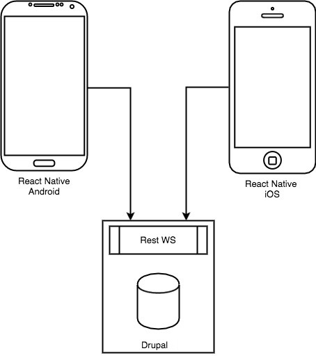

# Example app solution

This repository outlines a solution for creating a suite of native mobile application, for iOS and Andriod, pulling from a single content repository. The aim is to demonstrate and communicate the requirements for ongoing operations to keep the applications up to date with minimal additional work outside of making edits and additions to the content repository.

## Technical components

The example utilises React Native and the [Expo](https://expo.io/) library and toolchain to generate and maintain the native runtimes. In addition Expo provides automation tools to submit the applications to the app stores and also has the capability to make <abbr title="Over The Air">OTA</abbr> updates for critical alerts and messaging.

The code is in [TypeScript](https://www.typescriptlang.org/), implementing [React Native](https://reactnative.dev/) components.

The content is pulled from a [Druapl 9 JSON:API](https://www.drupal.org/docs/core-modules-and-themes/core-modules/jsonapi-module/api-overview) endpoint. This CMS also powers the [website](https://parksaustralia.gov.au/). There would be some additional data structures set up in Drupal for the apps where data structures do not already exist. This content centralisation allows content editors to quickly update content across the platforms, implementing the paradigm of _publish once, distribute many_.

## Workflow / Updates

There are three types of updates:

1. Changes detected from the CMS that trigger an OTA update
2. Changes detected from the CMS that trigger a new build and automatic app store submissions
3. Changes in git repository to non-CMS controlled content or structure with automatic app store submission

A [plugin for Drupal](https://www.drupal.org/project/build_hooks) needs to be installed and configured so it can trigger a CI/CD platform for update types 1 and 2. [Github Actions](https://docs.github.com/en/actions) is an option for CI/CD.

For the third type of update, ideally the development environment required to make code/structural changes could be web-based, allowing department staff to run it in the <abbr title="Standard Operating Environment">SOE</abbr>. This repository demonstrates this capability through the use of [Github Codespaces](https://github.com/features/codespaces).

Submission of code changes would be achieved through a Pull Request where demo builds of the app(s) would be available through Expo for testing prior to merging into the main branch. Merging into the main branch would build and distribute the apps to the app stores via the CI/CD.
